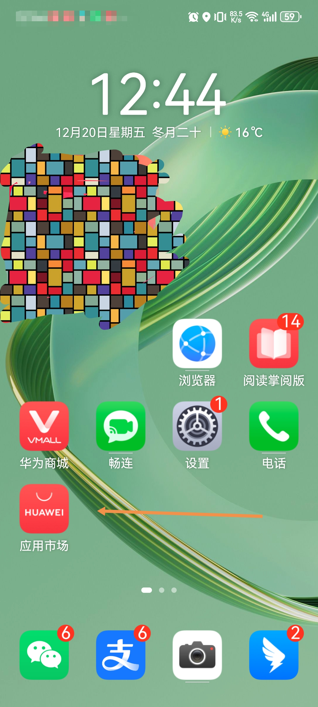
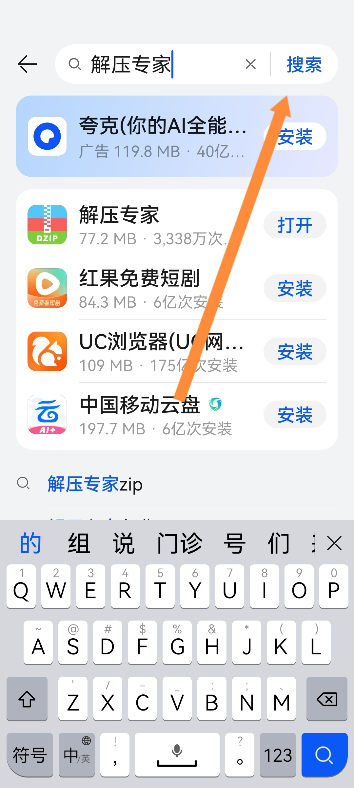
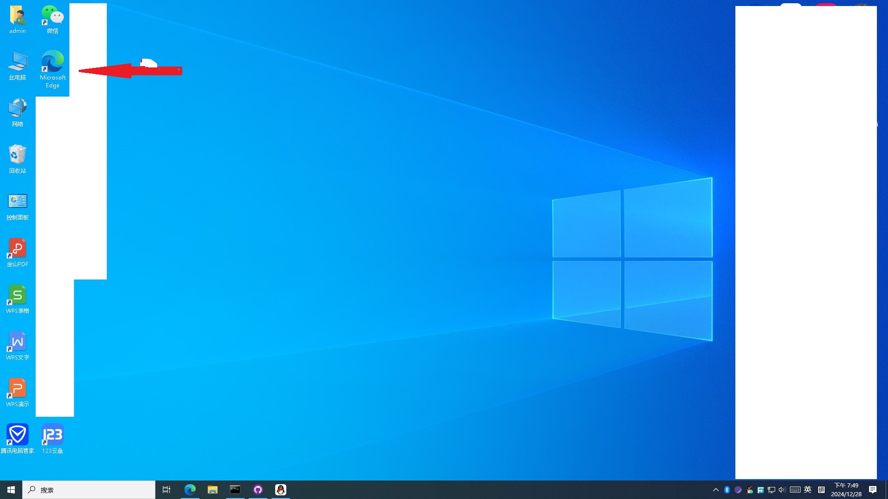
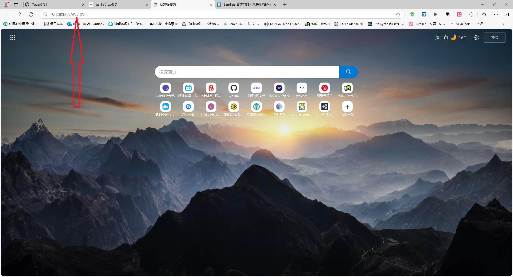
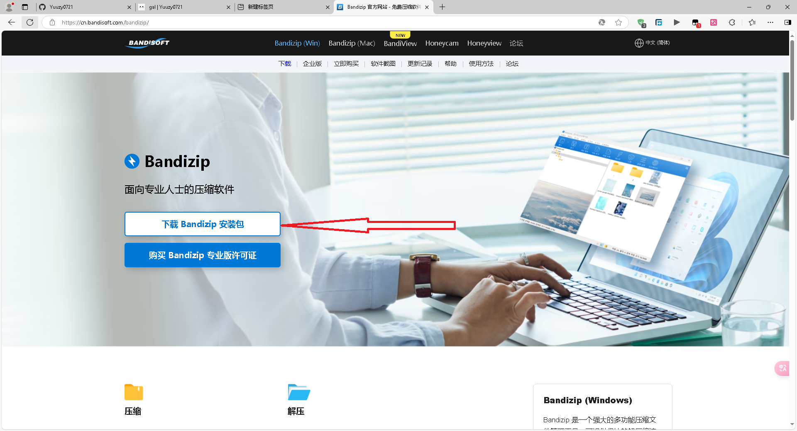
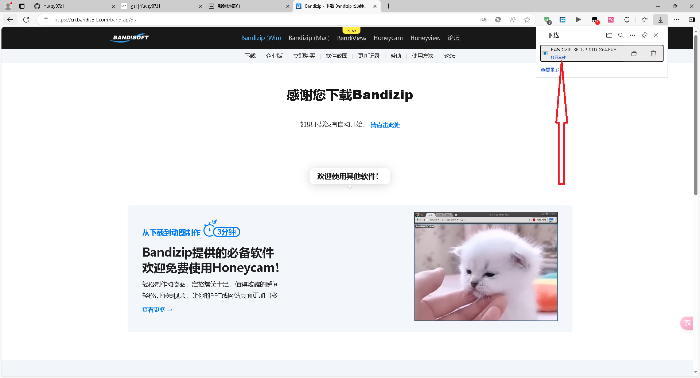
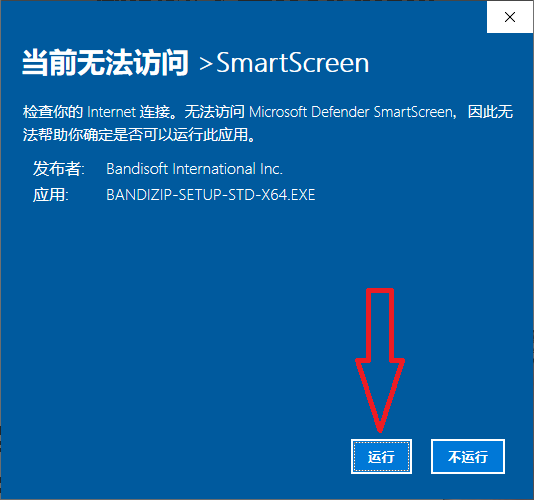
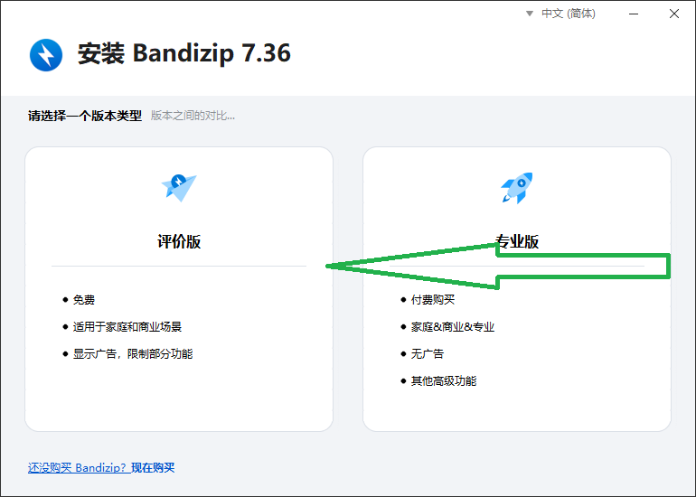
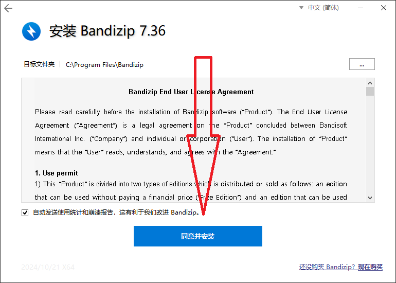
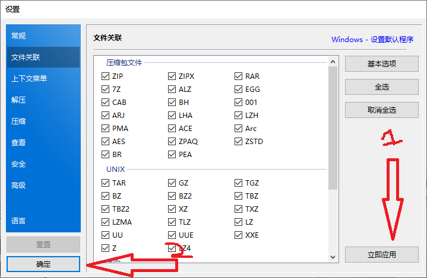

# (gal)资源群常见问题解答

[Yuuzy0721](https://github.com/Yuuzy0721) 著

注：图片加载超级慢，请耐心等待

**教程暂未完成**

# 目录

- [前言](#前言)
- [正文](#正文)
  - [1.解压篇](#1解压篇)
    - [1.1 压缩包](#11-压缩包)
      - [1.1.1 为什么要用压缩包](#111-为什么要用压缩包)
      - [1.1.2 为什么要分卷压缩](#112-为什么要分卷压缩)
      - [1.1.3 压缩包的常见格式](#113-压缩包的常见格式)
    - [1.2 解压](#12-解压)
      - [1.2.1 解压前的准备](#121-解压前的准备)

# 前言

开始之前先上圣经:  
1.解压密码是什么？  
2.解压到最后成了文件夹怎么弄？  
3.阿婆主下次能别整那些密码的什么的可以吗？对于脑子不太好转的人，弄不出来啊  
4.up，为什么PC的001解压不了了？我用的7zi，002和003都是直接无法解压，001显示末端文件错误，后缀改不改都一样  
5.草了怎么还有密码  
6.解压密码是啥？  
7.安卓的怎么找不到啊  
8.手机版本是哪个啊  
9.好家伙，没见过套娃的，没见过有这么多的，感觉没必要套那么多吧  
10.好的 怎么搞 解压教程看着都会，但就是没有一个说它怎么下载 要不阿婆加一下我好友，直接把东西分享过来？  
11.joi模拟器怎么用啊兄弟？ 就是你那个高塔之城的莉兹 不会啊 英语我看不懂  
12.那个，我不玩梗，我是真不懂。平时我都是用网盘下载的，用krkr打开就行了的有些直接解包的用的也是ZA，但我确实不知道zip.001.002是用来干啥的，我开始以为是不同版本  
13.为什么文件解析失败啊，你发的有问题啊，重新发啊  
14.为什么后缀不能改apk,这不是软件吗，怎么解压出来一大堆文件  
15.为什么joi不支持啊，不是说安卓吗，标题党举报了  
16.没有游戏本体吗？为什么我都是什么save  
解压码是什么啊？为什么不能在线解压啊？我在线解压了奥，在线解压为啥炸了啊？链接咋用啊？下载太慢咋办啊？你行不行啊？为什么不能直接发安装包啊？手机能玩吗？手机为啥玩不了啊？模拟器是那个啊？怎么解压啊？解压后的文件在哪啊？这个链接微信怎么打不开啊？要钱吗？怎么不免费啊。提取码是啥？要用什么解压啊？有中文吗？下载完了该怎么办啊？我用百度云解压了哦，怎么解压完了链接就炸了啊？链接炸了能再补一次吗？001 002 003格式的怎么处理啊？分卷是什么意思啊？解压过后怎么解压啊？解压出来了一堆文件怎么办啊？为什么要分卷，直接放一起不行？搞那么花里胡哨。  
┐(´-｀)┌  
~~血压已经高起来了~~

-------我是分割线^^--------

本教程编写的目的是为了帮助小白学习如何解压等基础知识 ~~，以及降低群u的血压~~，本篇教程可能会涉及**文件移动**等基础内容，但不会专门写如何移动文件，如果你不会，请自行在浏览器中搜索，能搜到的尽量不要麻烦别人^^(话说为什么四级标题渲染出来比段落还小)

~~剩下的以后想到了再写^^~~

# 正文

## 1.解压篇

### 1.1 压缩包

#### 1.1.1 为什么要用压缩包

有些时候，资源内的文件过多，如果直接发出来会导致下载起来十分麻烦。因此，我们就需要一个东西来把这些文件打包在一起，而***压缩包***正好可以做到这件事 ~~，所以以后就别天天问别人为什么老是发压缩包了~~。

#### 1.1.2 为什么要分卷压缩

> 这是文件在上传到网络上时，由于受到上传容量的限制，一些比较大的文件就必须压缩成几个分卷文件，才能完成上传。下载使用时，必须把所有的分卷文件放到同一位置（如同一个文件夹），才能把这个文件完整地解压出来。

摘自 https://ask.zol.com.cn/x/7944494.html  
~~偷懒^^~~

#### 1.1.3 压缩包的部分格式

常见格式：  
- .zip
- .rar
- .7z

**分卷压缩**格式(数字后缀名)：  
- .001
- .002
- .003
- …………(有多少个**分卷文件**后缀名就有多少个数)

自解压文件：
- .exe

### 1.2 解压

#### 1.2.1 解压前的准备

安卓：第一步：打开 **应用市场**   
第二步：点击 **搜索栏**   
第三步：输入“***解压专家***”并点击 **搜索**   
第四步：找到“***解压专家***”并点击 **安装**(因为我安装过了所以截图里的是“打开”)   
第五步：打开“***解压专家***”，在弹出的授权弹窗中全部点击“**仅使用期间允许**”或“**始终允许**”(当然，也可能是“**允许**”)[暂时缺少图片^^]

鸿蒙：第一步：打开 **应用市场**   
第二步：点击 **搜索栏**   
第三步：输入“***解压专家***”并点击 **搜索**   
第四步：找到“***解压专家***”并点击 **安装**(因为我安装过了所以截图里的是“打开”)   
第五步：打开“***解压专家***”，在弹出的授权弹窗中全部点击“**仅使用期间允许**”或“**始终允许**”[暂时缺少图片^^]

鸿蒙NEXT：缺少资料 ~~，不写了~~

iOS(暂时缺少图片教程)：第一步：打开 **AppStore**  
第二步：点击 **搜索栏**  
第三步：输入“***解压专家***”并点击 **搜索**  
第四步：找到“***解压专家***”并点击 **获取**  
第五步：打开“***解压专家***”，在弹出的授权弹窗中全部点击“**允许**”

Windows： 第一步：在桌面上找到你的 **浏览器**，双击打开它  
   
在win10及以上的Windows系统里，自带的浏览器长这样  
   
第二步：点击 **顶端** 的 **搜索栏**  
   
第三步：输入这个网址："https://cn.bandisoft.com/bandizip/"而后按下回车键  
第四步：点击“ **下载Bandzip安装包**”  
   
第五步：下载完成后，点击 **打开文件**  
  
第六步：在弹出的窗口中点击“**运行**”  
  
第七步：在安装窗口中选择”**评估版**“  
  
第八步：选择”**同意并安装**“  
  
第九步：在弹出的设置中先点击”**立即应用**“，再点击”**确定**“  

